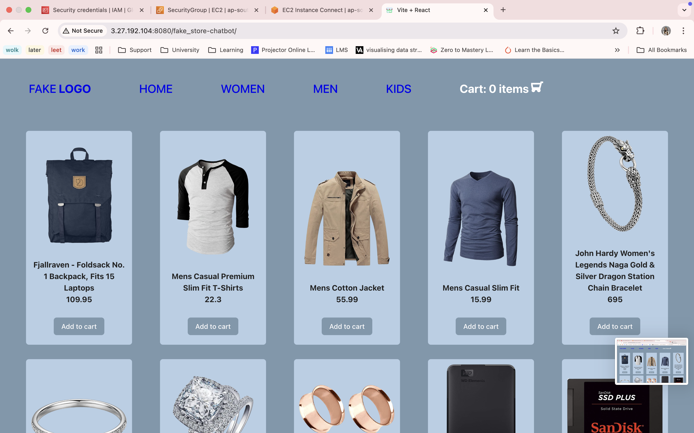

# AWS Architecture

1.  **EC2** (Elastic Compute Cloud)

React + Vite- for instant project startup, rund a Node.js server at http://3.27.192.104:8080/fake_store-chatbot/

2.  **RDS** (Relational Database Cloud)

Stores user data and shopping cart information. MySQL database instance for data management.

4. **S3** (Simple Storage Service)

For storing static assets (product images)

React frontend fetches assets directly from S3 URLs for faster delivery.

///////

## Steps for Deployment

1. ``npm run build``

Build hosted via Node.js server on EC2

Database Setup (RDS):

- created an RDS MySQL instance.

- connected from the EC2 backend.

Storage Setup (S3):

- uploaded product images and assets to an S3 bucket.

2. Access the Deployed App:

http://3.27.192.104:8080/fake_store-chatbot/

## Example running on my own Cloud Server (EC2 instance)

